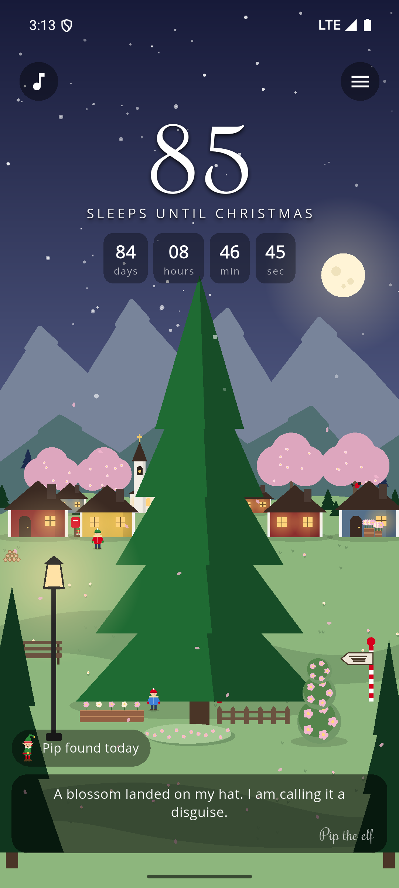
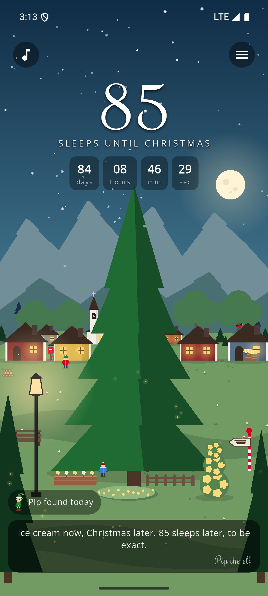
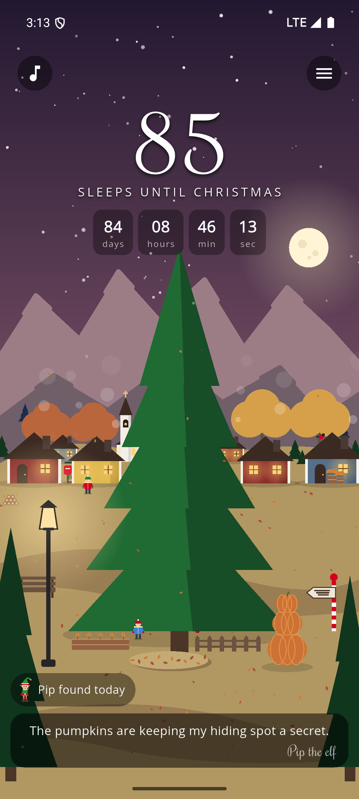
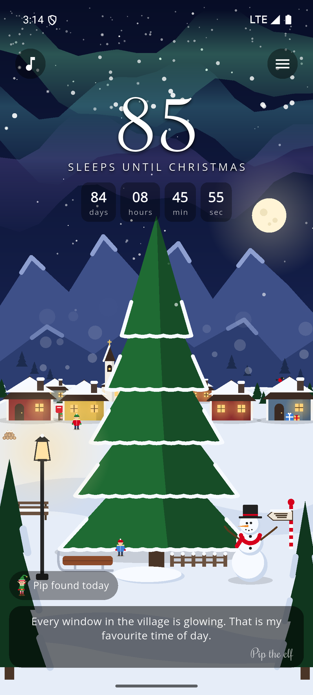
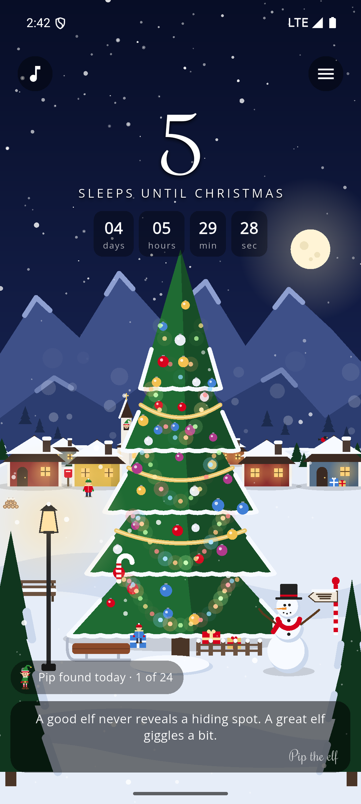
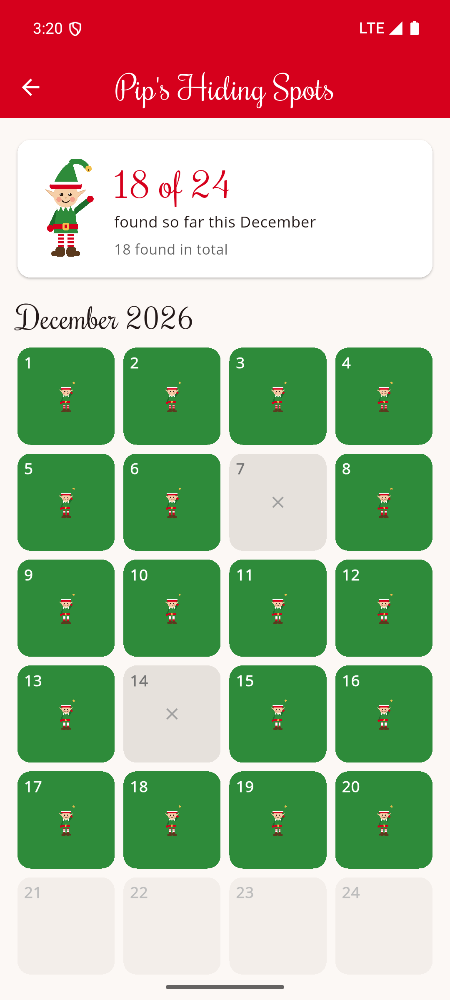
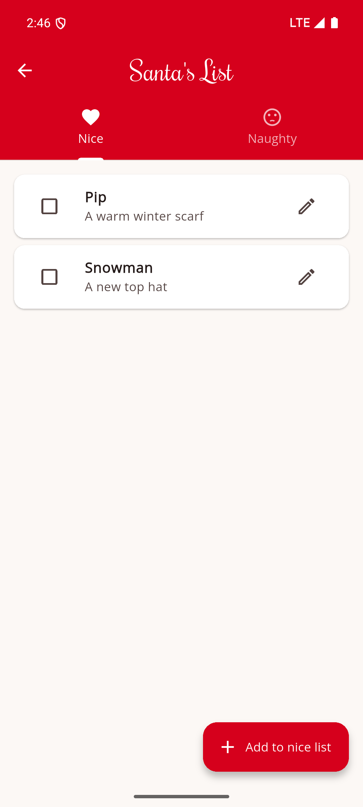

# Christmas Buddy

Count the sleeps until Christmas with Pip the elf in a cosy village that changes with the seasons. Find his new hiding spot each day, watch the tree fill with decorations through December, and keep track of Santa's list.

Christmas Buddy is a free, open-source Android app built with Flutter. It works offline, with your lists, settings and discoveries saved on your device. No account is needed.

## Screenshots

### Four seasons

The village follows the northern seasons automatically. You can also choose a season in **Settings → Village season**.

<table>
  <tr>
    <td align="center" width="50%"></td>
    <td align="center" width="50%"></td>
  </tr>
  <tr>
    <td align="center">Spring</td>
    <td align="center">Summer</td>
  </tr>
  <tr>
    <td align="center" width="50%"></td>
    <td align="center" width="50%"></td>
  </tr>
  <tr>
    <td align="center">Autumn</td>
    <td align="center">Winter</td>
  </tr>
</table>

Captured on an Android 15 emulator using the manual season choices on the same September date. Changing the season keeps the countdown and Pip's daily progress intact; Christmas decorations still arrive through December.

### Countdown and lists

<table>
  <tr>
    <td align="center" width="33%"></td>
    <td align="center" width="33%"></td>
    <td align="center" width="33%"></td>
  </tr>
  <tr>
    <td align="center">Count the sleeps</td>
    <td align="center">Find Pip every day</td>
    <td align="center">Keep Santa organised</td>
  </tr>
</table>

Captured on an Android 15 emulator with the app's date set to 20 December. Gift ideas and calendar progress are sample data; the calendar shows 18 finds, two missed days and four days still to come. [View all screenshots](assets/screenshots).

## Features

- **Your Christmas countdown:** count down to Christmas Eve or Christmas Day.
- **Four seasons:** follow the year automatically, or choose spring, summer, autumn or winter in Settings. Discover blossom, summer flowers and fireflies, autumn leaves, and winter snow.
- **A village that changes:** discover new tree decorations and seasonal surprises as December unfolds.
- **Find Pip:** look for a new hiding spot every day, follow warmer and colder clues, and collect December finds on an advent calendar.
- **Snow and carols:** swipe to stir the winter snow and enjoy six familiar Christmas tunes, with adjustable snow and sound settings.
- **Santa's list:** keep nice and naughty lists, add gift ideas, and tick off presents as they are ready.
- **Reminders and sharing:** choose a daily December reminder or share a picture of your countdown.

## Run on Android

Install Flutter, the Android SDK and a compatible Java JDK. Start an Android emulator or connect a phone with USB debugging enabled. The current development baseline is Flutter 3.29.3 / Dart 3.7.2.

```sh
flutter pub get
flutter devices
flutter run -d ANDROID_DEVICE_ID
```

Replace `ANDROID_DEVICE_ID` with the device ID shown by `flutter devices`.

The app is not currently available in an app store. To build an APK for local installation:

```sh
flutter build apk --release
```

The APK is written to `build/app/outputs/flutter-apk/app-release.apk`. Release builds currently use the development signing key.

## Development

```sh
flutter analyze
flutter test
```

To preview December without changing the device's date:

```sh
flutter run -d ANDROID_DEVICE_ID --dart-define=FAKE_DATE=2026-12-20T18:30:00
```

Build without `FAKE_DATE` to use the real date again.

The render tool can export scenes, hiding spots and app screens. In PowerShell:

```powershell
$env:RENDER_OUT = "$PWD/build/renders"
flutter test test/tools/render_test.dart
Remove-Item Env:RENDER_OUT
```

Set `RENDER_ICONS=1` to regenerate the icon artwork too, then run `dart run flutter_launcher_icons` and `dart run flutter_native_splash:create`. The music generator is in `scripts/make_music.py` and requires Python, NumPy and SoundFile.

The main app code is in `lib/src/`, grouped by screen and feature. Tests and rendering tools are in `test/`.

## Credits and licence

- Code and artwork: [MIT](LICENSE).
- Fonts: Open Sans and Rochester, from Google Fonts under their open licences.
- Music: traditional public-domain carols, with arrangements and recordings covered by the project's MIT licence.

Christmas Buddy first appeared on Google Play in 2022. The 2026 version brings a new village, Pip the elf and an open-source home for the project.
